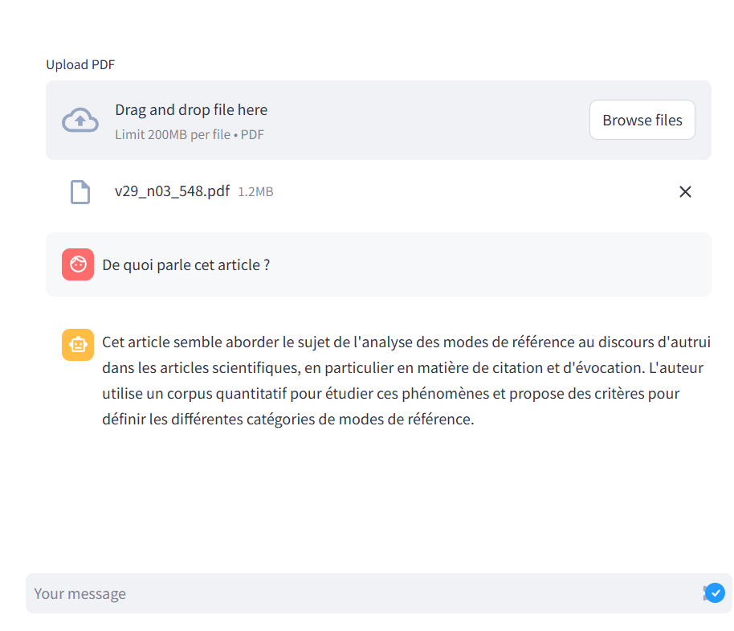

<!DOCTYPE html>
<html lang="en">
<head>
    <meta charset="UTF-8">
    <meta name="viewport" content="width=device-width, initial-scale=1.0">
    <title>README</title>
    
</head>
<body>
    <h1>PDF RAG Chatbot</h1>
    
Un chatbot utilisant LangChain et Streamlit pour interroger des fichiers PDF.

    
    <h2>Installation</h2>
    
Créer un environnement virtuel et installer les dépendances :

    <pre><code>python -m venv venv</code></pre>
    <pre><code>venv\Scripts\activate</code></pre>
    <pre><code>pip install -r requirements.txt</code></pre>
    
    <h2>Exécution</h2>
    
Lancer l'application Streamlit :

    <pre><code>streamlit run pdf_rag.py</code></pre>
    
    <h2>Capture d'écran</h2>
    
Interface du chatbot :

    
</body>
</html>
